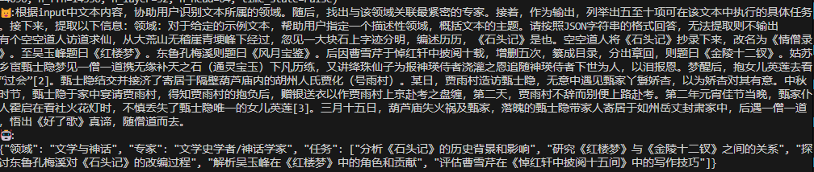

# This is a state for rwkv6_7b_v2.1 that generates domain, expert role in this domain and specific tasks that this export can do given input context.

* The input is solely the context that you want this model to analyze
* The output are domain, expert role in this domain and specific tasks that this export can do in a jsonl format. 

# Please refer to the following demo as test code:
```python
from rwkv.model import RWKV
from rwkv.utils import PIPELINE, PIPELINE_ARGS
import torch

# download models: https://huggingface.co/BlinkDL
model = RWKV(model='/home/rwkv/Peter/model/base/RWKV-x060-World-7B-v2.1-20240507-ctx4096.pth', strategy='cuda fp16')
print(model.args)
pipeline = PIPELINE(model, "rwkv_vocab_v20230424") # 20B_tokenizer.json is in https://github.com/BlinkDL/ChatRWKV
# use pipeline = PIPELINE(model, "rwkv_vocab_v20230424") for rwkv "world" models
states_file = '/home/rwkv/Peter/rwkv_graphrag/agents/persona_domain_states/RWKV-x060-World-7B-v2.1-20240507-ctx4096.pth.pth'
states = torch.load(states_file)
states_value = []
device = 'cuda'
n_head = model.args.n_head
head_size = model.args.n_embd//model.args.n_head
for i in range(model.args.n_layer):
    key = f'blocks.{i}.att.time_state'
    value = states[key]
    prev_x = torch.zeros(model.args.n_embd,device=device,dtype=torch.float16)
    prev_states = value.clone().detach().to(device=device,dtype=torch.float16).transpose(1,2)
    prev_ffn = torch.zeros(model.args.n_embd,device=device,dtype=torch.float16)
    states_value.append(prev_x)
    states_value.append(prev_states)
    states_value.append(prev_ffn)

cat_char = '🐱'
bot_char = '🤖'
instruction ='根据input中的领域和任务，协助用户识别input文本中存在的实体类型。 实体类型必须与用户任务相关。 避免使用诸如“其他”或“未知”的通用实体类型。 非常重要的是：不要生成冗余或重叠的实体类型。用JSON格式输出。'
input_text = '有个空空道人访道求仙，从大荒山无稽崖青埂峰下经过，忽见一大块石上字迹分明，编述历历，《石头记》是也。空空道人将《石头记》抄录下来，改名为《情僧录》。至吴玉峰题曰《红楼梦》。东鲁孔梅溪则题曰《风月宝鉴》。后因曹雪芹于悼红轩中披阅十载，增删五次，纂成目录，分出章回，则题曰《金陵十二钗》。姑苏乡宦甄士隐梦见一僧一道携无缘补天之石（通灵宝玉）下凡历练，又讲绛珠仙子为报神瑛侍者浇灌之恩追随神瑛侍者下世为人，以泪报恩。梦醒后，抱女儿英莲去看“过会”[2]。甄士隐结交并接济了寄居于隔壁葫芦庙内的胡州人氏贾化（号雨村）。某日，贾雨村造访甄士隐，无意中遇见甄家丫鬟娇杏，以为娇杏对其有意。中秋时节，甄士隐于家中宴请贾雨村，得知贾雨村的抱负后，赠银送衣以作贾雨村上京赴考之盘缠，第二天，贾雨村不辞而别便上路赴考。第二年元宵佳节当晚，甄家仆人霍启在看社火花灯时，不慎丢失了甄士隐唯一的女儿英莲[3]。三月十五日，葫芦庙失火祸及甄家，落魄的甄士隐带家人寄居于如州岳丈封肃家中，后遇一僧一道，悟出《好了歌》真谛，随僧道而去。'
ctx = f'{cat_char}:{instruction}\n{input_text}\n{bot_char}:'
print(ctx)

def my_print(s):
    print(s, end='', flush=True)


args = PIPELINE_ARGS(temperature = 1, top_p = 0.2, top_k = 0, # top_k = 0 then ignore
                     alpha_frequency = 0.5,
                     alpha_presence = 0.5,
                     alpha_decay = 0.998, # gradually decay the penalty
                     token_ban = [0], # ban the generation of some tokens
                     token_stop = [0,1], # stop generation whenever you see any token here
                     chunk_len = 256) # split input into chunks to save VRAM (shorter -> slower)

pipeline.generate(ctx, token_count=1000, args=args, callback=my_print,state=states_value)
print('\n')
```    
# The final printed input and output:
 